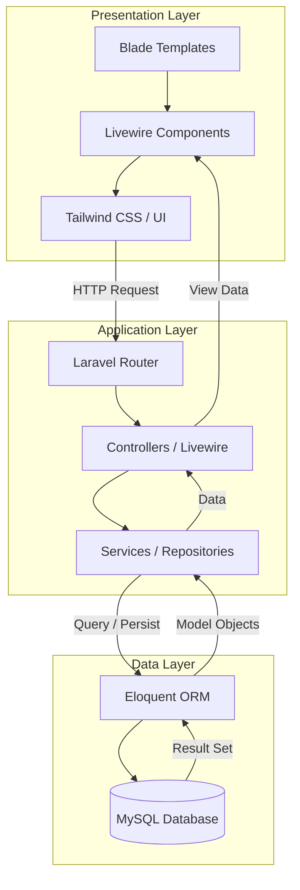

# Deployment Hardening Checklist

## System Architecture



## 1) Run migrations

```bash
php artisan migrate --force
```

## 2) Set production env values

Add to `.env`:

```env
APP_ENV=production
APP_DEBUG=false
FINANCIAL_ALERT_EMAIL=your-alert-email@example.com
```

## 3) Assign user roles

Default role is `owner`. To set roles explicitly:

```bash
php artisan user:set-role owner@example.com owner
php artisan user:set-role manager@example.com admin
php artisan user:set-role staff@example.com staff
```

## 4) Scheduler setup (required)

Run Laravel scheduler every minute on your host:

```bash
php artisan schedule:run
```

Scheduled jobs included:
- `loans:reconcile-statuses` (daily 01:00)
- `financial:monitor` (daily 01:30)
- `db:backup-daily` (daily 02:00)
- `db:backup-verify` (daily 03:00)
- `financial:reconcile` (monthly day 1, 04:00)

## 5) Backup restore drill (recommended monthly)

1. Identify latest file in `storage/app/backups`
2. Restore to a staging database
3. Run smoke tests:

```bash
php artisan test --filter=FinancialIntegrityTest
php artisan test --filter=FundsGuardrailTest
```

## 6) Integrity dashboard

For `owner/admin` users:

- URL: `/admin/integrity-check`
- Check mismatch counts, failed jobs, and recent audit logs.

## 7) Notes

- `audit_logs` is immutable by design.
- Financial models (`loans`, `payments`, `funds`) now support soft deletes.
- PostgreSQL check constraints and financial indexes are added via migration.
